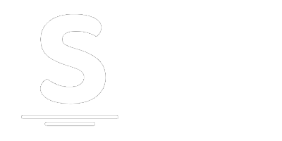
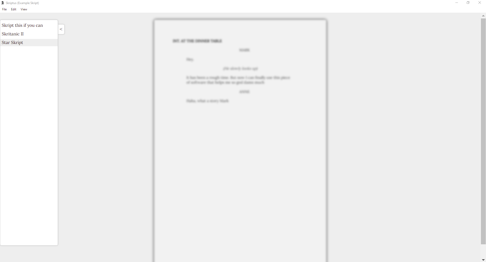
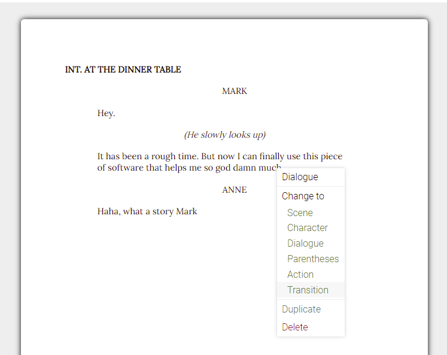
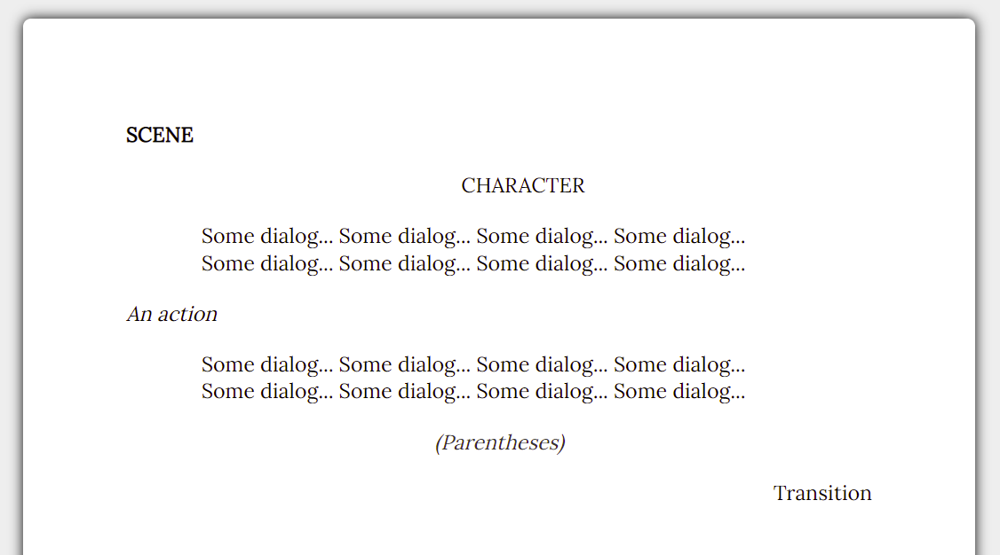

# Skriptus 📑

 📑 The modern screenplay software. Extendable, free, simple design. 📑

 

## Table of Contents
* [Installation](#installation)
* [First Steps](#first-steps)
* [Features](#features)
* [Extending Skriptus](#extending-skriptus)
* [Images](#images)

## Installation
1. Download or clone using `git clone https://github.com/nojasm/skriptus.git`

2. Install npm from [here](npmjs.com)

3. Run `npm install` and `npm start`

If you encounter any issues, please [open an issue](https;//github.com/nojasm/skriptus/issues)

## First Steps
See [the Wiki](https://github.com/nojasm/skriptus/wiki/Introduction) for a simple introduction.

## Features
### Elements
- Scene
- Character
- Dialogue
- Parentheses
- Transition
- Action

## Extending Skriptus
See [the Wiki](https://github.com/nojasm/skriptus/wiki/extending-) for instructions.

## Images

